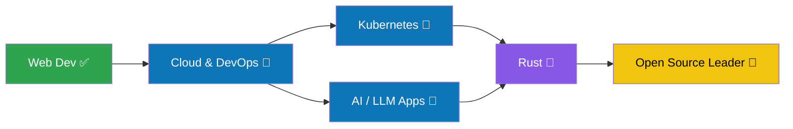

<div align="center">


<a href="https://github.com/debayandeb575-svg">

</a>

<br/>


<a href="https://github.com/debayandeb575-svg?tab=followers"></a>
<a href="https://github.com/debayandeb575-svg?tab=repositories"></a>


<br/><br/>

<a href="https://www.instagram.com/debayan.dev.9256"></a>
<a href="https://github.com/debayandeb575-svg"></a>
<!-- Add these: replace the ID/email, then remove the comment markers
<a href="https://www.linkedin.com/in/YOUR-LINKEDIN-ID"></a>
<a href="mailto:YOUR-EMAIL@gmail.com"></a>
-->

</div>


## 👨‍💻 About Me

<table>
<tr>
<td width="55%">

```js
const debayan = {
  name: "Debayan Deb",
  role: "Software Developer",
  location: "Kolkata, India 🇮🇳",
  focus: ["Web Dev", "AI/ML", "Cloud", "Open Source"],
  learning: ["Rust", "Kubernetes", "LLM Apps"],
  openTo: ["Collaboration", "Freelance", "Open Source"],
  funFact: "I debug with music on 🎧",
};
```

</td>
<td width="45%">

- 🌱 Learning **Rust, Kubernetes & GenAI**
- ☁️ Passionate about **Cloud & DevOps**
- 🤝 Open to **open-source & AI** projects
- ⚡ Motto: *Make it work, make it right, make it fast.*

</td>
</tr>
</table>

## 🛠️ Tech Stack

<details open>
<summary><b>💻 Languages & Frontend</b></summary>
<br/>

</details>

<details open>
<summary><b>⚙️ Backend & Databases</b></summary>
<br/>

</details>

<details open>
<summary><b>☁️ Cloud & DevOps</b></summary>
<br/>

</details>

<details open>
<summary><b>🤖 AI / ML & Data</b></summary>
<br/>

</details>

<details open>
<summary><b>🧰 Tools</b></summary>
<br/>

</details>

## 📈 Skill Levels

<div align="center">

| Skill | Level |
|:--|:--|
| **JavaScript / React** | 


 |
| **Python** | 


 |
| **Cloud & DevOps** | 


 |
| **AI / ML** | 


 |
| **Rust** *(learning)* | 


 |

</div>

## 📊 GitHub Analytics

<div align="center">


<br/>


<br/>


<br/>


</div>

### 🐍 Contribution Snake

<div align="center">
<picture>
  <source media="(prefers-color-scheme: dark)" srcset="https://raw.githubusercontent.com/debayandeb575-svg/debayandeb575-svg/output/github-contribution-grid-snake-dark.svg" />
  
</picture>
</div>

## 🗺️ My Learning Roadmap



## 🚀 Projects

👉 **[Browse all my repositories](https://github.com/debayandeb575-svg?tab=repositories)**

<!-- Project cards: replace REPO_NAME with a real repo, then remove the comment markers
<div align="center">
<a href="https://github.com/debayandeb575-svg/REPO_NAME"></a>
<a href="https://github.com/debayandeb575-svg/REPO_NAME_2"></a>
</div>
-->

## 🤝 Let's Collaborate

I'm open to **open-source projects, freelance work and AI/Cloud collaborations.** Message me on Instagram or open an issue on any of my repos.

<div align="center">

### 💬 *"Code is like humor. When you have to explain it, it's bad."*


⭐ If you like my profile, leave a star on my repos! ⭐

</div>
